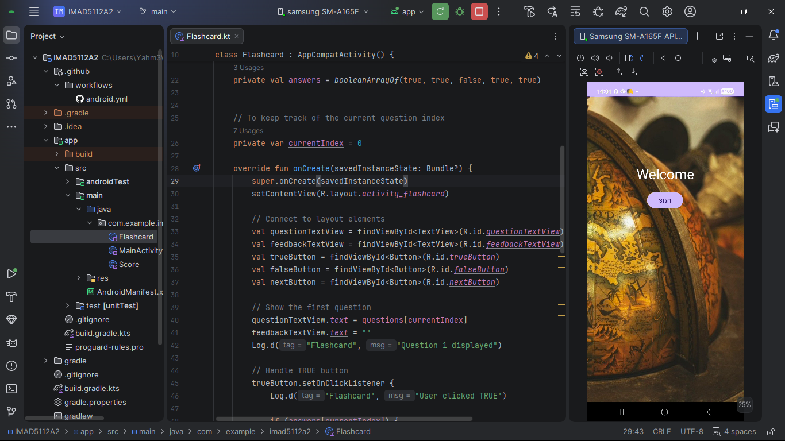
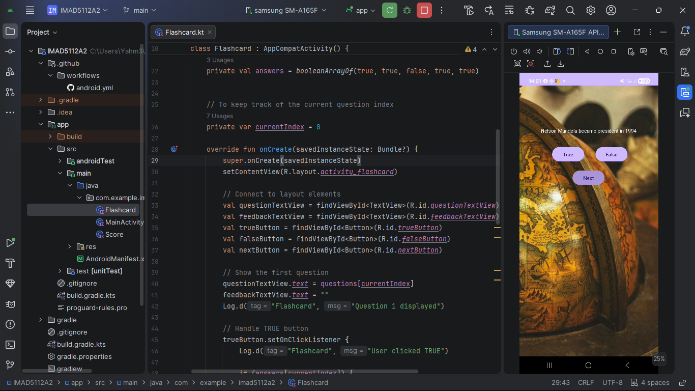
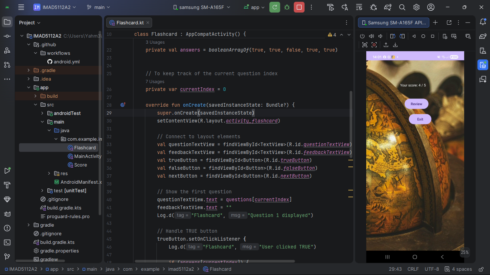
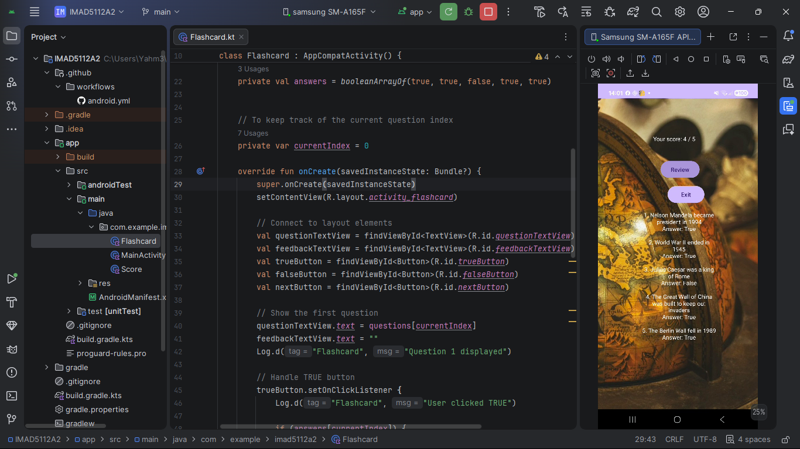

# IMA5112A2
## A school assignment project(life Hack or Urban Myth?)

A native Android flashcard quiz app built with **Kotlin** in Android Studio.  
Test your ability to tell the difference between genuine life hacks and viral urban myths!

---

##  App Overview

The internet is full of tips, tricks, and shortcuts — but not all of them are real. This app presents users with statements about everyday life hacks and challenges them to decide: **Hack (True)** or **Myth (False)?**

At the end of the quiz, the app provides a personalised score and feedback, and lets the user review all correct answers with explanations.

---

##  Features

- **Welcome Screen** — Brief app description and a Start button to begin the quiz
- **Flashcard Question Screen** — Displays 10 hack/myth statements one at a time with:
  - "Hack" (True) and "Myth" (False) answer buttons
  - Immediate feedback after each answer
  - A "Next" button to advance through questions
- **Score Screen** — Shows total correct answers and personalised performance feedback
- **Review Screen** — Lists all 10 statements with correct answers and explanations

---

##  App Flow

```
Welcome Screen
      ↓ (Start button)
Question Screen (loops through 5 questions)
      ↓ (after last question)
Score Screen
      ↓ (Review button)
Review Screen (all answers )
```
##  Design Decisions

- **View Binding** was used instead of `findViewById` for type-safe, null-safe UI access
- **FlashcardRepository** is an `object` (singleton) that centralises all question data, making it easy to add or change questions in one place
- **Log statements** are used throughout all activities with unique tags (`TAG`) for easy debugging and to demonstrate understanding of Android logging
- **RecyclerView** was chosen for the Review Screen because it efficiently handles scrollable lists of variable length
- `finish()` is called after navigating from QuestionActivity to ScoreActivity to prevent the user from pressing Back and returning to a completed quiz

## Screenshots

### Welcome


### Doing the quiz 


### Awaiting review


### Review 



##  How to Run

1. Clone this repository
2. Open in Android Studio
3. Connect an emulator or physical device
4. Press **Run ▶** to build and install the app

